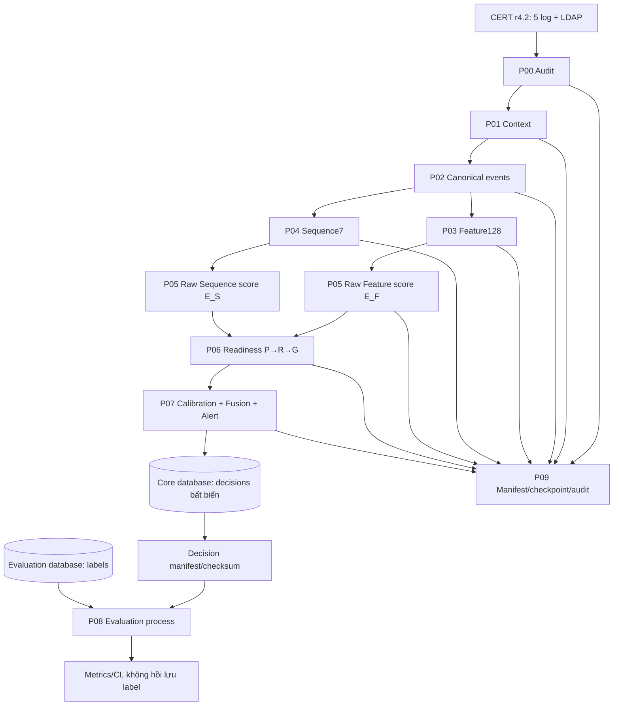
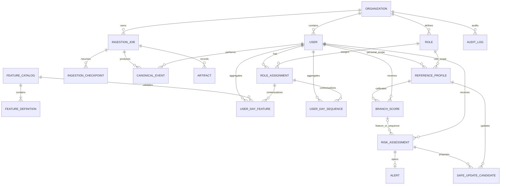

# Kiến trúc hệ thống phát hiện Insider Threat

## 1. Phạm vi và mục tiêu

Tài liệu này mô tả kiến trúc backend và dữ liệu cho framework phát hiện Insider Threat trên
CERT r4.2. Nguồn chuẩn nghiệp vụ là tài liệu
`Framework_sua_doi_Insider_Threat_Person_Role_Global.docx`; nguồn chuẩn triển khai là code,
catalog và schema hiện có trong repository.

Đơn vị phân tích là một **user-day** `(user_id, ngày D)`. Mỗi user-day được biểu diễn bằng hai
nhánh độc lập:

- **Feature branch**: đúng 128 đặc trưng metadata-only của `feature128.v5`, tạo raw score
  `E_F`.
- **Sequence branch**: chuỗi 7 loại sự kiện khách quan của `sequence7.v4` cùng các side
  channel, tạo raw score `E_S`.

Mỗi nhánh tự chọn đúng một reference theo thứ tự `PERSON → ROLE → GLOBAL`. Hai calibrated
score sau đó mới được fusion thành risk. Person, Role và Global là các tầng
reference/calibration; không phải ba deep model riêng.

Các mục tiêu kiến trúc:

- Ngăn leakage theo thời gian và leakage từ nhãn đánh giá.
- Cho phép hai nhánh fallback độc lập, có reason code giải thích được.
- Lưu được toàn bộ lineage từ dữ liệu nguồn đến alert.
- Chạy nhẹ bằng SQLite khi phát triển và chuyển sang PostgreSQL khi production.
- Hỗ trợ xử lý batch lớn, checkpoint/resume và output bất biến.
- Giữ workflow điều tra alert tách khỏi quyết định phát hiện đã được chốt.

Tài liệu này không đặc tả endpoint, HTTP method hoặc hợp đồng API cụ thể.

## 2. Ranh giới kiến trúc

| Boundary | Trách nhiệm | Được phép chứa | Không được chứa |
|---|---|---|---|
| Transport/application | Xác thực, request context, giới hạn kích thước, ánh xạ lỗi, điều phối transaction | DTO vận hành, request ID, actor | Business rule readiness/fusion bị nhân bản |
| Ingestion/control plane | Audit nguồn, idempotency, progress, checkpoint, artifact manifest | URI, checksum, số dòng, cursor | Nhãn/scenario/answer key |
| Core data plane | Identity, role timeline, canonical event, user-day, reference, score, assessment, alert | Dữ liệu cần cho scoring và giải thích | Ground truth đánh giá |
| Domain | Readiness, fusion và các bất biến pure-Python | Dataclass, config versioned, reason code | ORM/session hoặc phụ thuộc transport |
| Artifact storage | Partition lớn, model artifact, manifest, checksum | Canonical/feature/sequence/model export | Dữ liệu chưa hoàn tất được đánh dấu READY |
| Evaluation plane | Join decision bất biến với label, tính metric và CI | Label, incident, scenario, evaluation run | Credential được cấp cho API/ingestion/scorer |
| Configuration/catalog | Khóa feature, token, split, policy threshold và version | `feature128.v5`, `sequence7.v4`, `framework.v5` | Thay đổi âm thầm trong cùng version |

Business rule phải nằm ở domain hoặc validation layer. Transport chỉ gọi và chuyển kết quả;
persistence chỉ bảo vệ tính toàn vẹn, quan hệ và lịch sử.

## 3. Tổng quan luồng dữ liệu



## 4. Pipeline P00-P09

### P00 - Audit nguồn

Input là năm CSV `logon`, `device`, `file`, `http`, `email` và LDAP snapshots.

P00 kiểm tra header, checksum, số dòng, date range, sortedness, dung lượng dự kiến và memory
budget. Mỗi lần nhập có `IngestionJob`, `idempotency_key` và trạng thái tiến độ. Một input có
cùng checksum/idempotency key không được tạo dữ liệu trùng.

Output kiểm tra được:

- Job và source manifest.
- Số dòng tổng, đã xử lý, bị reject.
- Min/max timestamp.
- Checkpoint theo partition.
- Artifact trạng thái `STAGED`, `READY`, `INVALID` hoặc `ARCHIVED`.

### P01 - Context

LDAP được chuyển thành role timeline effective-dated. Mỗi `RoleAssignment` dùng khoảng nửa mở
`[valid_from, valid_to)`; các khoảng của cùng user không được overlap. Khi chấm ngày D, chỉ
được dùng snapshot có effective date không sau D.

PC context `OWN/SHARED/FOREIGN/UNKNOWN` được fit từ Train-only theo đơn vị distinct
`(user_id, day)`, rồi đóng băng. PC là `SHARED` khi có ít nhất 5 user và dominance `<0,5`;
nếu không, owner chỉ được gán khi dominance `>=0,5`, tie-break theo `user_id` tăng dần.
PC chưa thấy hoặc không đủ dominance là `UNKNOWN`. Role `UNKNOWN` là trạng thái rõ ràng,
không được suy diễn từ snapshot tương lai.

### P02 - Canonical events

Mỗi raw row tạo một canonical event; năm nguồn được append dọc, không join ngang.

Các trường logic tối thiểu gồm source, original ID, timestamp, event date, user, PC, action,
object, PC/time context, source payload, payload hash và lineage tới ingestion job/row.

Timestamp CERT được hiểu là local wall-clock do dataset cung cấp. Nếu timezone chưa được
công bố chính thức, pipeline giữ nguyên trường ngày/giờ và chỉ gắn UTC làm sentinel lưu trữ;
sentinel này không phải khẳng định dữ liệu gốc là UTC. Chỉ dữ liệu khai rõ
`ABSOLUTE_OFFSET` mới được chuyển timezone.

Bất biến:

- Event phải idempotent và truy được về dòng nguồn.
- Partition theo `source/month`.
- Tổng dòng canonical cộng reject phải đối soát được với input.
- Không có cột label/scenario/insider flag.
- Payload lồng nhau cũng phải qua label firewall.
- `file.csv` có nghĩa copy sang removable media; action chuẩn là `FILE_COPY`.
- HTTP không đủ method/status/bytes để khẳng định upload hoặc download.

### P03 - Feature128

Canonical events được aggregate thành một `UserDayFeature` duy nhất cho mỗi
`organization + user + day + catalog`.

Bất biến:

- Catalog phải đúng `feature128.v5`, đủ 128 tên và ID duy nhất.
- Values và present mask phải cùng dimension với catalog.
- Không có `NaN/Inf`; raw count không âm; ratio trong `[0,1]`; entropy không âm.
- Minute-of-day trong `[0,1439]`; xử lý khoảng cách thời gian theo vòng tròn ở scoring.
- Giá trị undefined phải có `mask=false`.
- Nhóm History chỉ dùng dữ liệu trước D.
- `is_observed_day`, `is_active_day` và mask phải phân biệt ngày inactive với padding.
- Primary experiment chỉ dùng metadata. Raw content, keyword nội dung và OCEAN bị chặn;
  nếu nghiên cứu thì phải là ablation có schema/artifact riêng.
- HTTP không dùng risk catalog. Đặc trưng HTTP chỉ mô tả count, URL/hostname/path/query
  metadata, entropy/repetition và độ mới domain tính từ lịch sử past-only.
- Không suy diễn loại file từ extension nếu chưa có mapping được version hóa. Primary v5
  chỉ dùng distinct extension, entropy, độ dài extension, extensionless và repetition.
- Các chain được thiết kế theo kịch bản tấn công không thuộc primary model; X12-X15 là thống
  kê transition/gap tổng quát, không dùng cửa sổ USB→File hoặc File→Email tự đặt.

Không có giờ làm việc cố định trong CERT r4.2. Các feature thời gian dùng circular-time và
baseline chỉ từ ngày an toàn trước D. Person không đủ support thì fallback Role, sau đó Global.
`unusual_time_relative_to_baseline` là robust positive z-score của khoảng cách thời gian trên
vòng tròn 24 giờ; không phải cờ trước 07:00 hoặc sau 18:00.

### P04 - Sequence

Canonical events được sort ổn định theo timestamp và khóa tie-break đã cấu hình, sau đó tạo
một `UserDaySequence`.

Vocabulary chính khóa ở 7 token:

`LOGON`, `LOGOFF`, `DEVICE_CONNECT`, `DEVICE_DISCONNECT`, `FILE`, `HTTP`, `EMAIL`.

Token chỉ mô tả loại sự kiện quan sát được. Không có `HTTP_RISK`, `HTTP_NEW` hoặc
`HTTP_KNOWN`; độ mới domain là feature metadata past-only, không làm vocabulary phụ thuộc
lịch sử.

Các mảng `tokens`, `pc_contexts`, `calendar_contexts`, `gap_buckets`, `time_sin`, `time_cos`
và `event_uids` phải có cùng
độ dài. `seq_len` giữ chiều dài gốc; `stored_len` là chiều dài đã lưu. Nếu dài hơn 256, giữ
128 event đầu và 128 event cuối, đồng thời đặt `truncated=true`.

`calendar_contexts` chỉ chứa `WEEKDAY/WEEKEND` suy ra từ timestamp. Mỗi event quan sát phải có
`time_sin² + time_cos² ≈ 1`; event PAD phải có cả hai giá trị bằng 0.
`pc_contexts`, `gap_buckets`, calendar và cyclic time đều do pipeline tính từ canonical
events; API từ chối giá trị PC/gap do client khai. Gap bucket khóa là `[0,1)`, `[1,5)`,
`[5,30)`, `[30,120]` và `(120,+∞)` phút.

### P05 - Raw branch scores

Feature và Sequence được chấm độc lập:

- Feature input được robust-scale bằng median/MAD fit Train-only; missing value giữ
  `mask=false`.
- TCN–Transformer Autoencoder tái tạo Feature và cả token/PC/calendar/gap/time của Sequence.
- Raw reconstruction score của từng nhánh được hiệu chỉnh bằng empirical CDF của đúng
  reference đã chọn.

`BranchScore` lưu branch, trạng thái, raw score, calibrated score, selected level, reference,
support snapshot, fallback reasons, evidence, model/config version và scoring run. Evidence
phải đủ để giải thích top feature hoặc top transition.

### P06 - Readiness

Readiness được tính tại đầu ngày D từ `support_json` và `fitted_through` của reference artifact
đã lưu; scoring request không được tự khai support. `fitted_through < D`. Feature và Sequence
không dùng chung readiness decision.

Mỗi branch thử lần lượt `PERSON`, rồi `ROLE`, rồi `GLOBAL`; khi một tầng đủ thì dừng. Nếu
Global cũng thiếu, branch trả `NO_SCORE`.

Fallback chỉ do thiếu support. Không fallback vì score cao, transition mới hoặc kết quả không
giống kỳ vọng; đó là bằng chứng anomaly.

### P07 - Calibration, fusion và alert

Raw score được calibrate theo đúng `branch + selected level`, tạo `q_F` và `q_S` trong
`[0,1]`. Không cộng đồng thời score Person/Role/Global của cùng branch.

Reference lưu empirical CDF (`sorted_scores`) và backend tự tính calibrated score; client
không được gửi calibrated score. Fusion primary dùng `0,5/0,5` sau calibration.
Threshold primary là nearest-rank empirical quantile `0,995` của risk Validation, không dùng
label, sau đó được phát hành qua `LOCKED_ALERT_THRESHOLD` và đóng băng trước Test.

Fusion tạo `RiskAssessment` bất biến. Nếu risk vượt threshold đã khóa thì tạo một `Alert`
riêng cho workflow điều tra. Alert có thể đổi trạng thái, assignee và resolution; score và
assessment nguồn không được sửa theo kết quả điều tra.

### P08 - Evaluation

Evaluator là process riêng. Nó đọc snapshot/manifest của decision bất biến từ core database
bằng quyền read-only, rồi join với `evaluation_labels` trong evaluation database.

Evaluation ghi run, manifest checksum, metrics, denominator, confidence interval và dimensions.
Nhãn không được copy ngược về core database, artifact đầu vào model hoặc config threshold.

### P09 - Reproducibility và vận hành

Mỗi run phải truy được:

- Framework, feature catalog và model version.
- Input/output checksum.
- Artifact manifest và row count.
- Scoring run ID.
- Checkpoint/cursor.
- Actor/request ID và audit event.

Artifact chỉ chuyển sang READY sau khi ghi hoàn chỉnh và kiểm checksum. Output lớn phải ghi
atomic qua file tạm rồi rename/finalize.

## 5. Mô hình dữ liệu và quan hệ



Các aggregate chính:

- **Identity/context**: `Organization`, `User`, `Role`, `RoleAssignment`.
- **Ingestion/lineage**: `IngestionJob`, `IngestionCheckpoint`, `CanonicalEvent`, `Artifact`.
- **Catalog/user-day**: `FeatureCatalog`, `FeatureDefinition`, `UserDayFeature`,
  `UserDaySequence`.
- **Scoring**: `ReferenceProfile`, `BranchScore`, `RiskAssessment`.
- **Operations**: `Alert`, `SafeUpdateCandidate`, `AuditLog`.

Quan hệ và uniqueness quan trọng:

- User và Role thuộc một Organization; mọi truy vấn production phải scope theo Organization.
- External user ID và role code chỉ unique trong Organization.
- Một user không có hai RoleAssignment overlap.
- Một user-day có tối đa một vector/sequence cho cùng schema/version.
- Reference profile định danh bởi branch, level, scope, model/config/catalog version và khoảng
  fitted-through.
- RiskAssessment tham chiếu tối đa một Feature score và một Sequence score.
- Mỗi assessment chỉ mở tối đa một alert.
- Reference profile, branch score, assessment, scoring watermark, reference release và audit
  record là immutable; alert và active Personal pointer là workflow state mutable có audit.

## 6. Bất biến readiness

### 6.1 Feature branch

Các threshold mặc định nằm trong `backend/config/framework.v5.json`:

- Person: ít nhất 60 active days, span 90 ngày, 60 active days trong role hiện tại, coverage
  90%, 40 quan sát cho mỗi feature dùng và stale gap không quá 30 ngày.
- Role: role known, ít nhất 15 peer user khác subject, 300 peer user-days, 100 user-days gần
  nhất, coverage 90% và 200 support cho mỗi feature.
- Global: ít nhất 200 user, 10.000 user-days, coverage 90%, fit Train-only.

### 6.2 Sequence branch

- Current day: `seq_len < 2` trả ngay `S_CURRENT_LEN_LT_2` và `NO_SCORE`.
- Person: ít nhất 60 sequence-days, 1.500 transitions, span 90 ngày, 60 sequence-days trong role
  hiện tại và stale gap không quá 30 ngày.
- Role: role known, ít nhất 15 peer user, 300 sequence-days, 10.000 transitions và 2.000
  transitions trong 30 ngày gần nhất.
- Global: ít nhất 200 user, 10.000 sequence-days, 100.000 transitions, fit Train-only.

### 6.3 Bất biến chung

- `fitted_through` của reference phải **nhỏ hơn** `score_date`; cutoff được pipeline suy ra
  là `D-1`, không nhận ngày support do client khai.
- Person profile chỉ dùng lịch sử trong role epoch hiện tại.
- Chỉ role change thực sự đóng Person profile và đưa epoch mới về warm-up. Các LDAP row
  liền kề có cùng role vẫn thuộc một epoch; department/team chỉ là soft context.
- Role unknown bỏ qua Role và thử Global.
- Tất cả Person/Role/Global profile dùng cho Validation/Test phải frozen, fit Train-only và
  không chứa ngày đang score.
- Reason code được tạo theo thứ tự kiểm tra cố định; mọi điều kiện thiếu đã kiểm tra được lưu.
- Các terminal code gồm `F_INSUFFICIENT_DATA`, `S_INSUFFICIENT_DATA` hoặc
  `S_CURRENT_LEN_LT_2`.
- Threshold có thể sensitivity-test trên Validation nhưng phải khóa version trước Test.

## 7. Bất biến fusion

- Input fusion là calibrated percentile/tail probability hữu hạn trong `[0,1]`.
- Mặc định `w_F = 0,5`, `w_S = 0,5`.
- Khi cả hai branch có score, trọng số được normalize và risk là weighted sum.
- Khi chỉ một branch có score, trọng số branch còn lại về 0 và branch còn lại được normalize
  lên 1; risk bằng chính calibrated score đó.
- Khi cả hai branch `NO_SCORE`, risk là `None`, không tạo alert.
- Tổng trọng số của các branch hiện hữu phải dương.
- Threshold và weight được chọn trên Validation, không tối ưu trên Test.
- Fusion evidence phải lưu score nguồn, trọng số đã normalize, reason của branch thiếu và
  config version.

## 8. Bất biến cập nhật cá nhân an toàn

Safe update là state machine sau scoring, không phải một phần của việc tính score ngày D:

Primary Train/Validation/Test không tạo hoặc xử lý safe-update candidate. Cơ chế này chỉ bật
cho `PRODUCTION` và phải được báo cáo như thí nghiệm online riêng.

1. **Score-first**: ngày D chưa nằm trong personal profile.
2. **Candidate**: tạo `SafeUpdateCandidate` gắn với assessment, branch, role assignment và
   reference profile.
3. **Quarantine**: kiểm tra cửa sổ đóng `[D,D+30]`; `quarantine_until=D+30` và
   ngày đủ điều kiện sớm nhất là `eligible_on=D+31`.
4. **Reject**: không update nếu ngày D hoặc bất kỳ ngày nào trong cửa sổ quarantine có alert,
   hoặc role epoch đã thay đổi.
5. **Accept**: sau quarantine và không có điều kiện reject, tạo candidate được chấp nhận để
   materialize thành reference version mới.
6. **Audit**: lưu reason code, before/after checksum và thời điểm áp dụng.

Role change hoặc stale gap trên 30 ngày buộc Person fallback về Role/Global cho tới khi đủ
support lại. Role/Global frozen profile không được sửa bởi safe update. Trong production không
có ground truth tức thời, vì vậy “safe” chỉ có nghĩa conservative; phải đánh giá riêng
freeze-person và online-person để đo poisoning risk.

## 9. Label firewall và hai database

### 9.1 Core database

Core database phục vụ ingestion, scoring và vận hành. Nó chứa hành vi, user-day, reference,
decision, alert và audit, nhưng không chứa ground truth.

Validation hiện quét recursive mọi key trong payload và từ chối các tên liên quan đến
`label`, `scenario`, `insider`, `malicious`, `ground_truth`, `answer_key`, `is_threat` và các
biến thể. Canonical schema cũng không có cột nhãn.

`split=TRAIN/VALIDATION/TEST` được phép vì đây là partition theo ngày, không phải label.

### 9.2 Evaluation database

Evaluation database phải là database vật lý riêng, không chỉ là table/schema cùng credential.
Nó chứa:

- `evaluation_labels(user_id, day, incident_id, scenario, answer_metadata, checksum)`.
- `evaluation_runs` với model/config và hai manifest checksum.
- `evaluation_metrics` với value, denominator, CI và dimensions.

Credential evaluation chỉ cấp cho evaluator. API, ingestion worker và scorer không được nhận
credential này. Evaluator chỉ đọc decision bất biến hoặc export manifest từ core. Luồng dữ
liệu một chiều là:

```text
Core decisions --read-only/export--> Evaluator <--labels-- Evaluation DB
                                      |
                                      +--> Evaluation metrics
```

Không có luồng label quay về core, reference profile, threshold, feature, sequence hoặc model
input. Việc tune chỉ dùng aggregate metric trên Validation qua quy trình release có kiểm soát.

## 10. SQLite cho phát triển và PostgreSQL cho production

| Thuộc tính | SQLite development/test | PostgreSQL production |
|---|---|---|
| Mục đích | Chạy local, fixture, integration test nhỏ | Nhiều worker, dữ liệu lớn, vận hành dài hạn |
| URL mặc định | `sqlite:///data/runtime/insider_threat.db` | Cấu hình `postgresql+psycopg://...` |
| Foreign key | Bật bằng `PRAGMA foreign_keys=ON` | Native FK/check/unique |
| In-memory test | `StaticPool` để giữ chung schema qua session | Không áp dụng |
| Concurrency | Hạn chế, không phù hợp batch worker song song lớn | Transaction/locking/indexing production |
| JSON | Kiểm tra phần lớn ở application/domain | Nên dùng JSONB và index có chọn lọc |
| Schema lifecycle | Có thể auto-create trong development | Dùng Alembic migration; tắt auto-create |
| Isolation tenant | Application scope | Application scope và cân nhắc PostgreSQL RLS |

SQLAlchemy model và domain rule phải giữ portable. Không viết business logic phụ thuộc riêng
SQLite. Evaluation database vẫn phải tách thành file SQLite khác khi local và database/role
PostgreSQL khác khi production.

## 11. An toàn và guardrail vận hành

### 11.1 Access control

- Bắt buộc least privilege giữa API, ingestion, scorer, analyst và evaluator.
- API key đang là tùy chọn cấu hình; production cần cơ chế xác thực và rotation được khóa trước
  triển khai.
- Mọi truy vấn tenant phải scope bằng `organization_id`; PostgreSQL RLS là hardening cần quyết
  định, chưa được xem là đã triển khai.
- CORS dùng allowlist, không wildcard trong production.
- Secret chỉ lấy từ environment/secret manager, không ghi trong config hoặc artifact.

### 11.2 Data integrity và audit

- Dùng checksum cho input, artifact, catalog, reference và evaluation manifest.
- Ingestion dùng idempotency key; checkpoint cho phép resume không nhân đôi dữ liệu.
- Transaction phải rollback toàn bộ batch logic khi có lỗi.
- Risk decision và audit log bất biến; audit hỗ trợ before/after hash, previous/event hash,
  actor, request ID và IP.
- Alert workflow không được sửa risk/score nguồn.
- Catalog/version cùng tên không được tái sử dụng với nội dung khác checksum.

### 11.3 Resource guardrails

- `http.csv` phải stream/chunk; không đọc toàn bộ vào RAM.
- Checkpoint theo source/month; một lỗi nguồn không làm mất partition đã hoàn tất.
- Ghi artifact atomic; chỉ đánh dấu READY sau checksum và row-conservation check.
- Báo progress sau mỗi N dòng, ETA và peak RAM.
- Dừng có kiểm soát khi vượt memory/time budget.
- Ước lượng output trước khi chạy và kiểm safety margin dung lượng.
- Default hiện có: tối đa 1.000 event mỗi batch và 2 MiB mỗi request; production có thể giảm,
  không được tăng không giới hạn.

### 11.4 Privacy

Behavioral telemetry, LDAP role, email recipient, URL và file metadata là dữ liệu nhạy cảm.
Production cần mã hóa in transit/at rest, retention policy, access audit, masking log và quy
trình xóa theo chính sách tổ chức. `source_payload` chỉ giữ trường cần cho lineage/giải thích;
không log toàn bộ payload trong lỗi.

## 12. Versioning, split và reproducibility

Các hợp đồng khóa hiện tại:

- Feature catalog: `feature128.v5`, đúng 128 feature metadata-only.

## Execution profile cho máy 8 GB RAM

Primary experiment dùng `cert-user-day-store.v1`, không materialize toàn bộ raw event hoặc các
cửa sổ NPZ lặp lại trong RAM:

```text
CERT CSV (đọc từng source, từng ngày; bỏ content)
  -> source-day aggregate nén trên SQLite
  -> Train-only PC map
  -> user-day Feature128/Sequence7 nén
  -> Train-only scaler
  -> SQLiteWindowDataset dựng [D-29,D] theo từng user
  -> train weekly endpoints / score full LDAP universe
  -> frozen Train Person/Role/Global references
  -> Validation q=0.995
  -> frozen threshold Test metrics
```

Raw source có checkpoint riêng; daily tensor được nhận diện bằng checksum code + config; model
checkpoint sau từng epoch. Full experiment từ chối source có row cap, store chưa đến
`2011-05-17`, split thiếu hoặc không có branch global nào đạt readiness.
- Sequence: `sequence7.v4`, 7 token khách quan, `max_len=256`, head-tail `128+128`.
- Model: `tcn-transformer-ae.v4`, cửa sổ past-only đúng `[D-29,D]`.
- Framework config: `framework.v5`.
- Train: `2010-01-02` đến `2010-05-31`.
- Validation: `2010-06-01` đến `2010-09-30`.
- Test: `2010-10-01` đến `2011-05-17`.
- Safe-update quarantine: cửa sổ đóng `[D,D+30]`, sớm nhất áp dụng ở `D+31`.
- Safe-update admission: percentile trên ROLE/GLOBAL parent phải nhỏ hơn `0.90`.
- Incremental Personal release: tối đa `2%` mỗi 7 ngày và `10%` trong cửa sổ 30 ngày;
  bootstrap dùng support Feature/Sequence 60 ngày và tạo immutable reference version mới.

Mọi thay đổi feature, token, preprocessing, threshold, fusion weight, split hoặc role mapping
phải tăng version phù hợp. Branch score và assessment phải lưu ít nhất
`model_version`, `config_version`, catalog/vocabulary version, scoring run ID và checksum đầu
vào.

Không random split user-day. Do temporal window overlap, confidence interval không được xem
từng user-day là độc lập; evaluation dùng block bootstrap theo ngày/incident hoặc theo user.
Universe đánh giá gồm mọi `(employee, day)` mà employee có hiệu lực trong LDAP; ngày không có
event vẫn là inactive employee-day và nằm trong denominator. `eligible_day_mask` phân biệt
ngày này với padding/ineligible day.

## 13. Giả định và quyết định chưa khóa

Các mục sau chưa có đủ specification để xem là hợp đồng production:

- Timezone chuẩn, ranh giới ngày và daylight-saving policy cho dữ liệu ngoài CERT.
- Tie-break chính xác khi nhiều source event có cùng timestamp; `source_rank` và original ID
  cần được version hóa.
- Role-family mapping, xử lý role nhỏ và quyền thay đổi mapping sau Train.
- Cách định nghĩa timezone/ràng buộc lịch làm việc nếu triển khai ngoài CERT; primary CERT
  không có fixed work-hours.
- Công thức và cửa sổ chính xác cho `multi_channel_burst_count`; bốn chain X12-X15 đã bị bỏ.
- ROLE/GLOBAL support vẫn là artifact do scorer phát hành; riêng Personal safe-update được backend
  materialize từ candidate đã admission, quarantine và kiểm tra watermark đầy đủ.
- Kiến trúc model đã khóa là TCN–Transformer Autoencoder; còn phải chốt tiêu chí promotion,
  rollback và ngưỡng chấp nhận theo từng release.
- Alert budget, threshold production, severity bands và quy trình đổi threshold.
- Định nghĩa “chuỗi alert liên tiếp” và chính sách xử lý một alert phát hiện sau khi Personal
  release đã được materialize.
- Retention, encryption key management, data residency, backup/restore và disaster recovery.
- Cơ chế xác thực/ủy quyền production, RLS, service account và analyst permission model.
- Chiến lược PostgreSQL partition/index, object storage backend, worker queue và lịch compaction.
- SLA, retry/backoff, dead-letter handling và giới hạn timeout theo từng pipeline stage.
- Quy trình phê duyệt cho config/model release và quyền đọc artifact nhạy cảm.

Các quyết định trên phải được chốt bằng config/migration/runbook có version trước khi tuyên bố
hệ thống sẵn sàng production.
